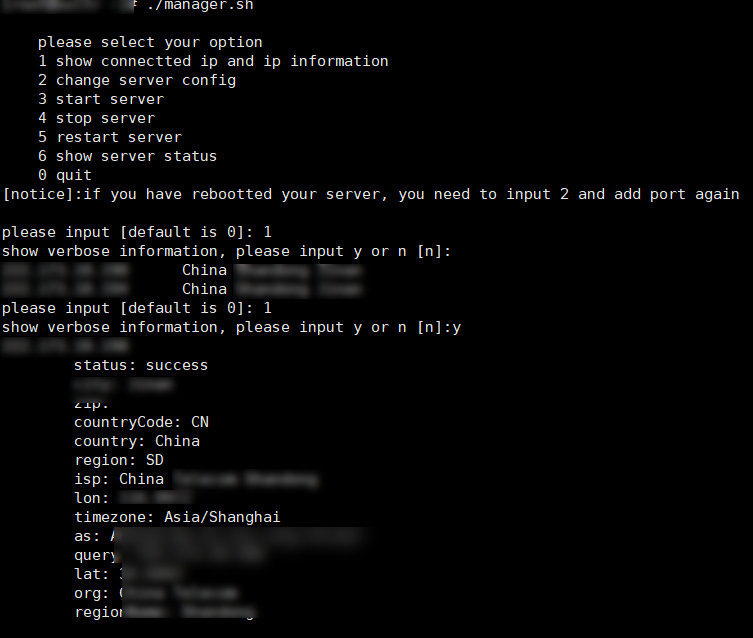

1. shadowsocksr管理工具
2. python2
3. 功能
    - 查看连接IP
    - 重启 关闭 状态
    - 修改配置
4. 部分截图 
    - 
5. 运行示例:
    - 
        ```
        [root@XXX ~]# ./manager.sh 

            please select your option
            1 show connectted ip and ip information
            2 chang server config
            3 start server
            4 stop server
            5 restart server
            6 show server status
            0 quit
            
        please input [default is 0]: 1
        show verbose information, please input y or n [n]:
        100.100.100.100      China XXX XXX             
        100.100.100.100      China XXX XXX               
        please input [default is 0]: 1
        show verbose information, please input y or n [n]:y
        100.100.100.100
            status: success
            city: XXX
            zip: 
            countryCode: CN
            country: China
            region: SD
            isp: China XXX XXX
            lon: 12
            timezone: Asia/Shanghai
            as: XXX
            query: 100.100.100.100
            lat: 11.0
            org: China XXX XXX
            regionName: XXX


        100.100.100.100
            status: success
            city: XXX
            zip: 
            countryCode: CN
            country: China
            region: SD
            isp: China XXX XXX
            lon: 78.3333
            timezone: Asia/Shanghai
            as: AS
            query: 100.100.100.100
            lat: 68
            org: China XXX
            regionName: XXX


        please input [default is 0]: 2
        Do you change your port [N/y]y
        please input port
        for example:
            8080,8978
        your ports:8880, 8090
        IPv6 support
        2018-04-16 03:40:01 INFO     shell.py:72 ShadowsocksR 3.4.0 2017-07-27
        stopped
        ShadowsocksR stop success
        IPv6 support
        2018-04-16 03:40:01 INFO     util.py:85 loading libsodium from libsodium.so.18
        2018-04-16 03:40:01 INFO     shell.py:72 ShadowsocksR 3.4.0 2017-07-27
        started
        ShadowsocksR start success
        change success.
        please input [default is 0]:        
        ```

5. ssr配置:https://www.qcgzxw.cn/1640.html/comment-page-64
